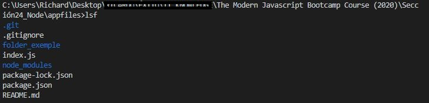
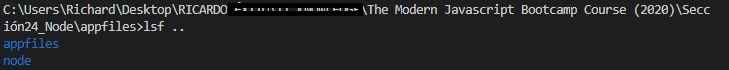

# Node JS Personal Command Line "lsf"

Creation of you own personal command to list all the files in a current directory.

Instead of typing the command line "ls" to list all the files in the current directory, this project is about creating you own type of command to do the samething. 

In this project I choose to use "lsf" instead of ls to list files.

##### In this project use:
* library chalk to color the output in the cmd
* loops, Promises, async and await
* nodejs
* forEach method

